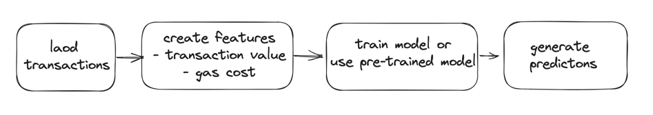
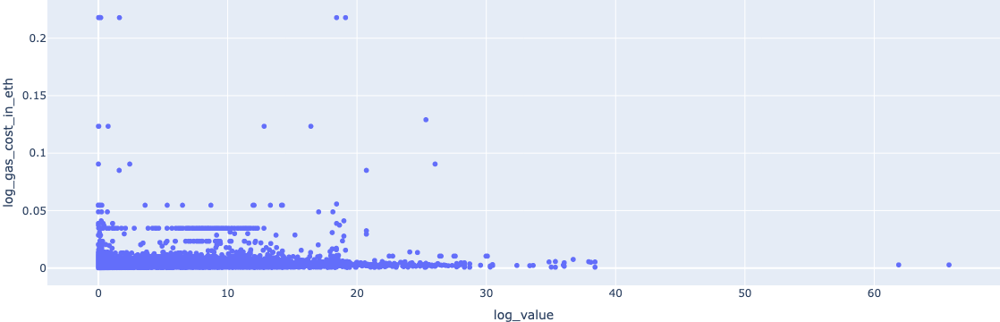
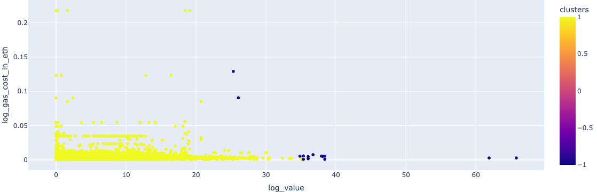
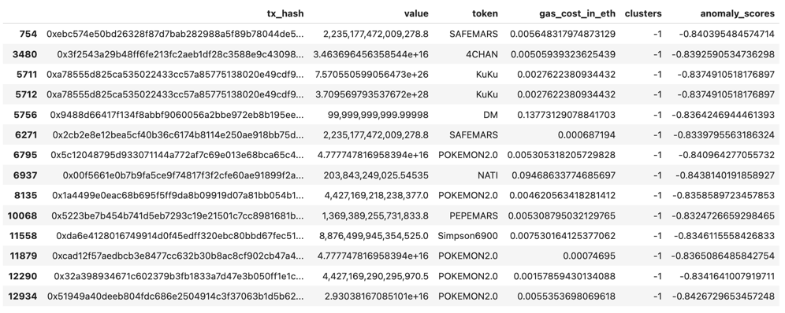

# Anomaly Detection App
Ethereum Mainnet Anomalous Transactions Detection App

## App Summary & Main Purpose
This app detects anomalous transactions on Ethereum Mainnet for the given block range or time interval. Current scope 
is ERC20 external token transfers.

In this problem context, an anomaly (outlier) can be defined as transactions that exchanges a potentially untrusted token. 
The app identifies such transactions so that users are prevented from interacting with untrusted tokens.



You can interact with an app through the Swagger (link provided below) or curl requests.

## How To Install and Use the App
**Pre-requisites**: Docker engine running locally. You can find the instructions [here](https://docs.docker.com/engine/install/)
to install Docker on your local machine.

**Build Docker image**: It will create the environment to run the app
```shell script
docker build -t anomaly-detection-app:0.0.1 .
```

**Spawn container**: It will start the app
```shell script
docker run -d -p 8000:8000 anomaly-detection-app:0.0.1
```
You can access the app and its documentation on http://0.0.0.0:8000/docs or interact with it from CLI.

**Interact from CLI**
```shell script
curl -X 'POST' \
  'http://0.0.0.0:8000/anomaly_detection/' \
  -H 'accept: application/json' \
  -H 'Content-Type: application/json' \
  -d '{
  "start_block": 0,
  "end_block": 0,
  "time_interval_in_seconds":0,
  "use_pre_trained_model": false 
}'
```
The app accepts 4 parameters:
- start_block
- end_block
- time_interval_in_seconds: defaults to `0`
- use_pre_trained_model: defaults to `false`

To get the data with the block range set `start_block` and `end_block`. `start_block` must be smaller than or equal to 
`end_block` and boundaries are inclusive.

To get the data with the time interval, set `time_interval_in_seconds` to an integer greater than 0. This will override 
using the app with the block range. This will get the latest blocks within the specified seconds approximately.

To use a pre-trained model, set `use_pre_trained_model` to `true`. This will load the latest model from the model registry.
Model training is required upon start.

After loading the data, the model is trained with 2 features:
- transaction value per token
- gas cost (by multiplying the effective gas price and gas used by transaction)

The app returns a list of dictionaries as an output, an example is as follows
```json
[
  {
    "transaction_hash": "0x3c73140e51879e17902c7eb3845a8990ea63df0637e3cea4c5a6453508eadfda",
    "value": "2,103,429,269,563,549.75",
    "token": "BUGATTI",
    "gas_cost": "0.00087476",
    "anomaly_score": "0.8432",
    "etherscan_link": "https://etherscan.io/tx/0x3c73140e51879e17902c7eb3845a8990ea63df0637e3cea4c5a6453508eadfda"
  }
]
```
Each dictionary item in the output is unique per `transaction_hash` and `token`, so you might get duplicate transactions 
in the results.

**To stop the app** run
```shell script
docker stop $(docker ps -a -q)
```

## Interpretation of the Predictions 
To illustrate how anomaly-detection-app works, I used
- 18183000-18183050 block range as training dataset
- 18370728-18370788 block range as test dataset

The distribution of features in the log scale (as the both features are highly positively-skewed distributions) are as 
follows. The red circle shows where most of the samples are centered.



few outlier regions are visible:
- low value txs (left hand side of the circle)
- high gas_cost txs (above the circle)
- high value txs (right hand side of the circle)

The model detects transactions that exchanges tokens in extremely high values as anomalies, represented as dark blue 
points below.



When we filter by the anomaly-labeled transactions, we get transactions with potentially untrusted tokens like
- [POKEMON 2.0](https://etherscan.io/token/0x73d5b2f081cedf63a9e660a22088c7724af78774)
- [KuKu](https://etherscan.io/token/0x27206f5a9afd0c51da95f20972885545d3b33647)
- [Simpson6900](https://etherscan.io/token/0xAd6eEFb4f4a6Ce3E2cd2049C3104f5CE5ED082F0)
- [PEPEMARS](https://etherscan.io/token/0xd4496c6600ec15c695bd2c65d60e09c8d4d1e30c)

where there are only a few holders of those tokens.

Since our dataset is indexed by unique transaction_hash and token, the model only detects certain leg of the transaction 
as anomalous. For instance, [this transaction](https://etherscan.io/tx/0x51949a40deeb804fdc686e2504914c3f37063b1d5b628b5639fae57fa8a54c75) consists of trusted tokens and the POKEMON 2.0 token: 
USDT -> WETH -> POKEMON 2.0

Nevertheless, we can infer that if a transaction goes through an untrusted token we can flag it as anomaly. All in all, 
the aim of the app is to identify transactions with untrusted tokens, so that users are prevented from exchanging them.



## My Approach on Solving the Challenge and Key Architectural Decisions
While working on the challenge I kept my focus on having a reasonably working anomaly detection MVP product with a readable 
and high-quality code, within the more or less specified time-box.

Querying for every transaction on Ethereum Mainnet seemed suboptimal since they also include token mints, burns or 
internal contract transactions and so on.

So, I narrowed down the problem scope to use ERC20 token transfers only.

Moreover, since "better than a random" model is emphasized in the requirements, I only included 2 features:

### Alchemy as the source data provider
I first explored several data source providers (Alchemy and Etherscan). 
I chose Alchemy API because it offers endpoints for efficient querying and filtering of Ethereum transactions. 

I used [getAssetTransfers](https://docs.alchemy.com/reference/alchemy-getassettransfers) endpoint to get ERC20 token 
transfers. I also excluded internal transactions so that I only get transactions initiated by the users.

To get each gas spent for the transactions I used [getTransactionReceipts](https://docs.alchemy.com/reference/alchemy-gettransactionreceipts) endpoint.
- transaction value per token
- gas cost in ETH

### `IsolationForest` as the underlying algorithm
I researched on the anomaly detection problem first and most common statistical approaches used. Given the above features, I decided 
to approach this problem as an unsupervised machine learning problem.  
I chose Isolation Forest because of its decision tree-based, non-parametric and easy-to-understand nature.

I used [this blog post](https://towardsdatascience.com/isolation-forest-the-anomaly-detection-algorithm-any-data-scientist-should-know-1a99622eec2d) and [the original paper](https://www.researchgate.net/publication/224384174_Isolation_Forest) to understand how algorith works.

The algorithm focuses on detecting and isolating anomalous samples in a decision tree as early as possible. As early as 
possible here suggests that when fed into a decision tree an anomalous data point will be closer to the root node compared 
to common samples. By default, it constructs 100 decision trees and takes 256 samples to feed into each tree.

After constructing the trees, it measures the distance between the leaf node and the root node for each sample, then
takes the average of the distance measures per sample. Lesser the average distance the more likely that a sample is 
anomalous (or outlier).

I used the default parameters, only set the `contamination` parameter to 0.001 by intuition. This parameter controls
how much of anomalies are expected for the domain problem.

TODO insert here a tree image

### Local Filesystem as a Model Reistry
Requirements mentioned using the latest pre-trained model, that requires app saving the model either in memory or some 
storage solution.

Considering the time-box specification of the assignment, I chose local filesystem to show how a model registry could be 
integrated into this app. 

### Making a POST Endpoint and Containerization with Docker
I wrapped the core data fetching and model training & inference process in an API endpoint. Moreover, I used fastAPI as 
the framework because of its nice documentation and data validation capabilities.
 
I used Docker to create the required environment and the app. This enables users to install the app on any machine as a 
further improvement area.

## Further System Improvements
From system design perspective, a real-world implementation of this problem would use a database and model registry to 
track latest trained models. Mlflow can be one option for that. 

Also, this database could serve as storage for training
datasets as well.

From implementation perspective
- store API key in a secret manager and retrieve key from there
- pre-process data in a separate class so that AnomalyDetector have single responsibility around model training and inference
- implement more detailed error handling for loading transactions and data validation (e.g. checking for the logical 
ordering of start_block and end_block parameters)
- aggregate return value from the app per transaction hash so that it is more clean and informative

## For developers
### Setup Local Environment & Run Unit Tests
Change directory to your local repository
```shell script
cd <path-to-your-local-repository>
```

Create conda environment
```shell script
conda create --name anomaly-detection-env python=3.9.18
```

Activate environment
```shell script
conda activate anomaly-detection-env
```

Install requirements
```shell script
pip install -r requirements.txt
```

Add repository path to PYTHONPATH 
```shell script
export PYTHONPATH=<path-to-your-repo-root>
```

Run unit tests
```shell script
py.test tests
```

### Update Environment to Run  the Notebook
To run notebooks update environment with the following commands
```
pip install jupyter
pip install plotly
pip install seaborn
pip intall pydotplus
conda install python-graphviz
```
