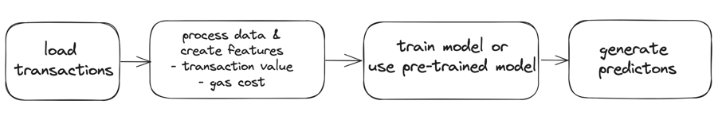
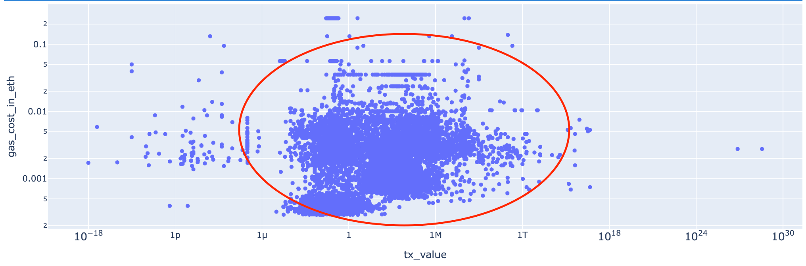
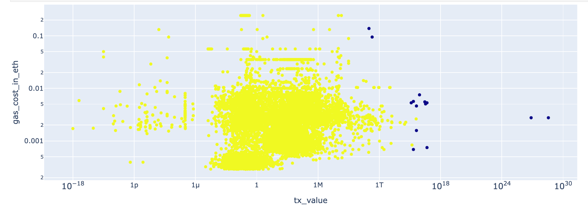
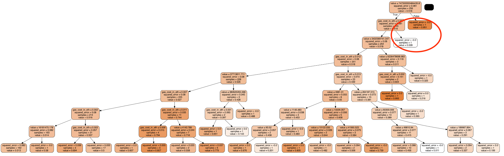

# Anomaly Detection App
Ethereum Mainnet Anomalous Transactions Detection App

## App Summary & Main Purpose
This app detects anomalous transactions on Ethereum Mainnet for the given block range or time interval. Current scope 
is ERC20 external token transfers.

In this problem context, an anomaly (outlier) can be defined as transactions that exchanges a potentially untrusted token. 
The app identifies such transactions so that users are prevented from interacting with untrusted tokens.



You can interact with an app through the Swagger (link provided below) or curl requests.

## How To Install and Use
**Pre-requisites**: Docker engine running locally. You can find the instructions [here](https://docs.docker.com/engine/install/)
to install Docker on your local machine.

**Build Docker image**: It will create the environment to run the app
```shell script
docker build -t anomaly-detection-app:0.0.1 .
```

**Spawn container**: It will start the app
```shell script
docker run -d -p 8000:8000 anomaly-detection-app:0.0.1
```
You can access the app and its documentation on Swagger http://0.0.0.0:8000/docs or interact with it from CLI.

**Interact from CLI**
```shell script
curl -X 'POST' \
  'http://0.0.0.0:8000/anomaly_detection/' \
  -H 'accept: application/json' \
  -H 'Content-Type: application/json' \
  -d '{
  "start_block": 0,
  "end_block": 0,
  "time_interval_in_seconds":0,
  "use_pre_trained_model": false 
}'
```
The app accepts 4 parameters:
- start_block
- end_block
- time_interval_in_seconds: defaults to `0`
- use_pre_trained_model: defaults to `false`

To get the data with the block range set `start_block` and `end_block`. `start_block` must be smaller than or equal to 
`end_block` and boundaries are inclusive.

To get the data with the time interval, set `time_interval_in_seconds` to an integer greater than 0. This will override 
using the app with the block range and get the latest blocks within the specified seconds approximately.

To use a pre-trained model, set `use_pre_trained_model` to `true`. This will load the latest model from the model registry.
Model training is required upon start.

After loading the data, the model is trained with 2 features:
- transaction value per token
- gas cost

The app returns a list of dictionaries as an output, an example is as follows
```json
[
  {
    "transaction_hash": "0x3c73140e51879e17902c7eb3845a8990ea63df0637e3cea4c5a6453508eadfda",
    "value": "2,103,429,269,563,549.75",
    "token": "BUGATTI",
    "gas_cost": "0.00087476",
    "anomaly_score": "0.8432",
    "etherscan_link": "https://etherscan.io/tx/0x3c73140e51879e17902c7eb3845a8990ea63df0637e3cea4c5a6453508eadfda"
  }
]
```
Each dictionary item in the output is unique per `transaction_hash` and `token`, so you might get duplicate transactions 
in the results.

**To stop the app**
```shell script
docker stop $(docker ps -a -q)
```

## Interpretation of the Predictions 
To illustrate how anomaly detection app works, I used
- 18183000-18183050 block range as training dataset
- 18370728-18370788 block range as test dataset

The distribution of features from the test dataset in the log scale (as the both features are highly positively-skewed
distributions) are as follows. The red circle shows where most of the data are centered. Axes show the original range.



Some outlier samples/regions are visible:
- low value txs (left hand side of the circle)
- high gas_cost txs (above the circle)
- high value txs (right hand side of the circle)

After model training and running the predictions, the app detects transactions that exchanges tokens in extremely high 
values as anomalies, represented as dark blue points below.



When we filter by the anomaly-labeled transactions, we get transactions with potentially untrusted tokens like
- [POKEMON 2.0](https://etherscan.io/token/0x73d5b2f081cedf63a9e660a22088c7724af78774)
- [KuKu](https://etherscan.io/token/0x27206f5a9afd0c51da95f20972885545d3b33647)
- [Simpson6900](https://etherscan.io/token/0xAd6eEFb4f4a6Ce3E2cd2049C3104f5CE5ED082F0)
- [PEPEMARS](https://etherscan.io/token/0xd4496c6600ec15c695bd2c65d60e09c8d4d1e30c)

where there are only a few holders of those tokens.

Since our dataset is indexed by unique transaction_hash and token, the model only detects a certain leg of the transaction 
as anomalous, even though trusted tokens are part of the transaction. For instance, [this transaction](https://etherscan.io/tx/0x51949a40deeb804fdc686e2504914c3f37063b1d5b628b5639fae57fa8a54c75) 
consists of trusted tokens and the POKEMON 2.0 token: USDT -> WETH -> POKEMON 2.0

Nevertheless, we can infer that if a transaction goes through an untrusted token we can flag it as anomaly. All in all, 
the aim of the app is to identify transactions with untrusted tokens, so that users are prevented from exchanging them.


## My Approach on Solving the Challenge and Key Architectural Decisions
While working on the challenge I kept my focus on having a reasonably working anomaly detection MVP product with a readable 
and high-quality code, within the more or less specified time-box.

Querying for every transaction on Ethereum Mainnet seemed suboptimal since a transaction can also be a mint, burn or 
contract creation and so on. So, I started by narrowing down the problem scope to use ERC20 token transfers only.

Moreover, since "better than a random" model is emphasized in the requirements, I only included 2 features: the value of 
the transaction per token and gas cost.

### Alchemy as the source data provider
I  explored several data source providers (Alchemy and Etherscan) to get token transfer transactions. I chose Alchemy API 
because it offers endpoints for efficient querying and filtering of Ethereum transactions. 

I used [getAssetTransfers](https://docs.alchemy.com/reference/alchemy-getassettransfers) endpoint to get ERC20 token transfers. I also excluded internal transactions so that I 
only get transactions initiated by the users.

To get each gas spent for the transactions I used [getTransactionReceipts](https://docs.alchemy.com/reference/alchemy-gettransactionreceipts) endpoint. From that endpoint, I used 
`gasUsed` and `effectiveGasPrice` to calculate gas cost. After loading the transactions, I extracted the `gas_cost` 
feature by multiplying the two.

### Isolation forest as the underlying algorithm
I researched on the anomaly detection problem first and most common statistical approaches used. Given the above features, 
I decided to approach this problem as an unsupervised machine learning problem. I chose Isolation Forest because of its 
decision tree-based, non-parametric and easy-to-understand nature.

I used [this blog post](https://towardsdatascience.com/isolation-forest-the-anomaly-detection-algorithm-any-data-scientist-should-know-1a99622eec2d) and read [the original paper](https://www.researchgate.net/publication/224384174_Isolation_Forest) to understand how algorithm works.

The algorithm focuses on detecting and isolating anomalous samples in a decision tree as early as possible. The algorithm
starts by randomly selecting a feature from the dataset. It then chooses a random value within the range of that feature. 
This value serves as a threshold. 

Then, the algorithm uses this threshold to split samples. Samples on one side of the threshold are grouped together, 
and samples on the other side are grouped separately.

The above steps are repeated until the tree depth is reached (default is 8). This process is repeated for each tree in 
the algorithm. In the end, you have a collection of trees, where more common samples are grouped with other 
normal samples in the deeper nodes and anomalous samples isolated in the shallower nodes. Here is a random single tree 
visualization from the anomaly detection app, notice that there are 2 obvious anomaly samples (the top white and orange 
leaf nodes):



In the end, if a sample is isolated by many trees in the forest very quickly, it's considered as an anomaly. Conversely, if 
it takes many iterations to isolate a sample, it's more likely to be a normal, non-anomalous sample.

The algorithm assigns anomaly scores to all samples in the dataset. It is a normalized score between 0 and 1. It measures
how quickly a sample gets isolated among all trees. If it's isolated very quickly, it's given a high score, 
suggesting it's an anomaly. If it takes a long time to get isolated, it's considered normal. The closer the score is to 1, 
the more likely it's an anomaly, and the closer it is to 0, the more normal it is.

Also, you can set a threshold to decide what level of anomaly you want to detect. Samples with scores above certain 
threshold are considered anomalies, while those below the threshold are considered normal. This threshold parameter is 
controlled by `contamination` parameter. I set it to 0.001 by intuition. In simple terms, this parameter controls how much 
of anomalies are expected for the domain problem.

### Local filesystem as a model registry
Requirements mentioned that users can predict using the latest pre-trained model, so I used the local filesystem as the 
model registry. Each trained model is indexed by timestamp and saved in the app by `AnomalyDetector.fit_and_save_model`.

Considering the time-box specification of the assignment, I chose the local filesystem to show how a model registry 
could be integrated into the app to satisfy this requirement. 

### Making a POST endpoint and containerization with Docker
I wrapped the core data loading and model training & inference process in an API endpoint. Moreover, I used fastAPI as 
the framework because of its nice documentation and default data validation capabilities.

I preferred an API endpoint over making a Python package with a simple CLI because of OpenAPI specification which 
provide self-explanatory documentation. I used Docker to create the required environment and to run the app so that it 
is installable on any local or virtual machine.

## Further System Improvements
From system design perspective, a real-world implementation of this problem would use a database and model registry. 
Model registry can be used to track training runs, error metrics and training artifacts. Mlflow is one tool that provides 
those capabilities. A database would store the training and inference datasets, features and transactions & tokens 
detected as anomalies.

From the implementation perspective following can be improved:
- don't expose API key store it in a secret manager and retrieve the key from there
- pre-process data in a separate class so that `AnomalyDetector` have single responsibility around the model training and inference
- implement more detailed data validation and error handling logic (e.g. checking for the logical ordering of 
start_block and end_block parameters and raise 400 Bad request if it is not logically ordered)
- aggregate app return results by transaction_hash so that it is not repeated This can be achieved by refactoring 
`AnomalyDetectionOutput` to store token symbol mapping to transaction value per token. This way users can also display 
the entire transaction route.
```python
class AnomalyDetectionOutput(BaseModel):
    transaction_hash: str
    token2value: dict[str, float] # contains all tokens and values that transaction goes through
    gas_cost: str
    anomaly_score: str
    etherscan_link: str
```
- add unit testing for the POST endpoint, it is only tested with the integration testing approach

## For developers
### Setup Local Environment & Run Unit Tests
Change directory to your local repository
```shell script
cd <path-to-your-local-repository>
```

Create conda environment
```shell script
conda create --name anomaly-detection-env python=3.9.18
```

Activate environment
```shell script
conda activate anomaly-detection-env
```

Install requirements
```shell script
pip install -r requirements.txt
```

Add repository path to PYTHONPATH 
```shell script
export PYTHONPATH=<path-to-your-repo-root>
```

Run unit tests
```shell script
py.test tests
```

### Update Environment to Run  the Notebook
To run notebooks update environment with the following commands
```
pip install jupyter
pip install plotly
pip install seaborn
pip intall pydotplus
conda install python-graphviz
```
